# **Utility Control 3**

'Utility Control 3' is an application that helps user to control your utility bills. This is the third project in the Full Stack Software Development course. And this is my third way to control my expenses. The first method of writing in a notepad is inconvenient. The second way - using mobile applications, is good, but I always dreamed of making a free system. And this third way - the program I wrote, is the first step towards fulfilling the dream of creating my application for controlling expenses.


# Contents

* [**Project**](<#project>)
  * [Site Users Goal](<#site-users-goal>)
  * [User Stories](<#user-stories>)
  * [Site Owners Goal](<#site-owners-goal>)
* [**User Experience (UX)**](<#user-experience-(ux)>)
  * [Site Structure](<#site-structure>)
  * [Data Model](<#data-model>)
  * [Design Choices](<#design-choices>)
    * [Typography](<#typography>)
    * [Colour Scheme](<#colour-scheme>)
* [**Features**](<#features>)
  * [**Existing Features**](<#existing-features>)
    * [Main Menu](<#main-menu>)
    * [Action Menu](<#action-menu>)
    * [Add one row](<#add-one-row>)
    * [Automatic input](<#automatic-input>)
    * [Data validation](<#data-validation>)
    * [See the table](<#see-the-table>)
  * [**Future Features**](<#future-features>)
* [**Technologies Used**](<#technologies-used>)
  * [Languages](<#languages>)
  * [Python Packages](<#python-packages>)
  * [Frameworks, Libraries & Software](<#frameworks,-libraries-&-software>)
* [**Testing**](<#testing>)
  * [**Functionality Testing**](<#functionality-testing>)
    * [User Stories Testing](<#user-stories-testing>)
    * [Full Manual Testing](<#full-manual-testing>)
  * [**Code Validation**](<#code-validation>)
  * [**Responsivenes**](<#responsivenes>)
  * [**Browser Compatibility**](<#browser-compatibility>)
  * [**Known Bugs**](<#known-bugs>)
    * [Resolved](<#resolved>)
    * [Unresolved](<#unresolved>)
  * [**Additional Testing**](<#additional-testing>)
    * [Lighthouse](<#lighthouse>)
    * [Peer review](<#peer-review>)
* [**Deployment**](<#deployment>)
  * [Deployment To Heroku](<#deployment-to-heroku>)
  * [To fork the repository on GitHub](<#to-fork-the-repository-on-github>)
  * [To create a local clone of this project](<#to-create-a-local-clone-of-this-project>)
* [**Credits**](<#credits>)
  * [**Content**](<#content>)
  * [**Media**](<#media>)
* [**Acknowledgements**](<#acknowledgements>)

# Project

## Site Users Goal
The user of 'Utility Control 3' wants to have access to an intuitive application that saves utility bills and calculates daily usage.

## User Stories
I have included some user stories to clarify why particular feature matters. These will then be tested and confirmed in the [Testing](<#testing>) section.

- As a user, I want to be able to add expense entries.
- As a user, I want to be able to delete an expense entry in case of erroneous entries.
- As a user, I want to have access to the function to calculate the statistics of the average consumption of funds for a communal service per day.
- As a user, I want to be able to view a table with all expense records.
- As a user, I want to have an easy way to return to the main menu.

## Site Owners Goal
The goal of the site owner is to provide an application where the user can enter utility expense data in a simple way, access all expense records, view expense statistics, and delete the entry in case of incorrect input.

[Back to top](<#contents>)

# User Experience (UX)

The 'Utility Control 3' application has a command line interface with a custom theme. The color scheme is selected in such a way as to be intuitive to the user and highlight: errors, successful input, selection menu, differences in selection options, the input that must be made for this selection, menu headings.

[Back to top](<#contents>)

## Site Structure

The 'Utility Control 3' is a terminal based application that is being presented in a one page website. When the application starts the user will be presented with a short welcome message and a menu with 4 options. The menu consists of the utility choices: *electricity*, *broadband*, *food* and *gas*. Read more about the different choices in the [Features](<#features>) section.

In the top of the page there is also a 'Run Program' button that the user can use to reload the application if needed.

[Back to top](<#contents>)

## Data Model
To store all data in the application I made a choice to use [Google Sheets](https://www.google.co.uk/sheets/about/). All data in the application is being sent and retrieved from the Google Sheet.

<details><summary><b>Name of workbook: <i>codeinstitute-utility</i></b></summary>


</details><br/>

Each utility is stored on its own sheet.

<details><summary><b>Name of electricity worksheet: <i>electricity</i></b></summary>

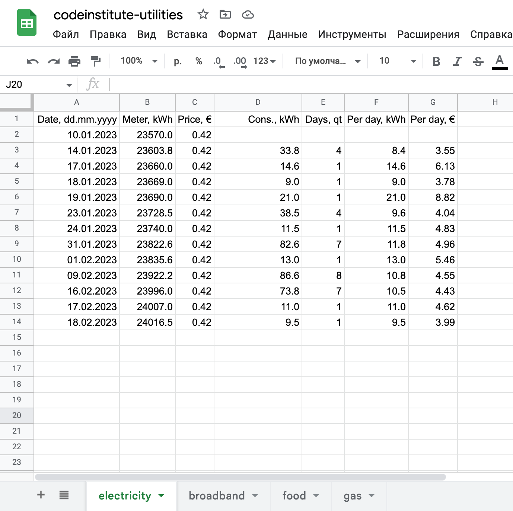
</details><br/>

<details><summary><b>Name of broadband worksheet: <i>broadband</i></b></summary>

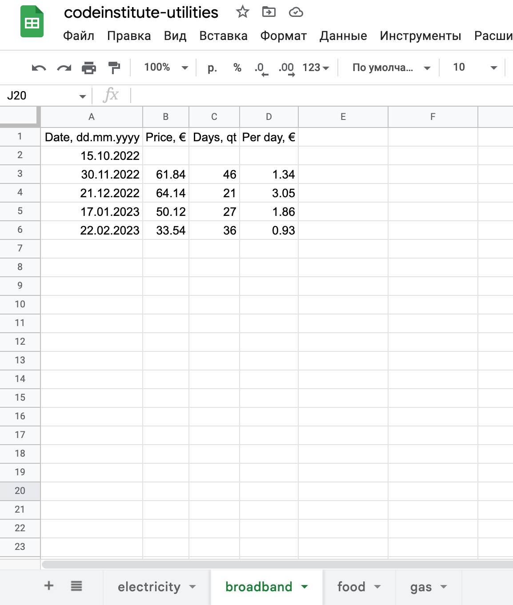
</details><br/>

<details><summary><b>Name of food worksheet: <i>food</i></b></summary>

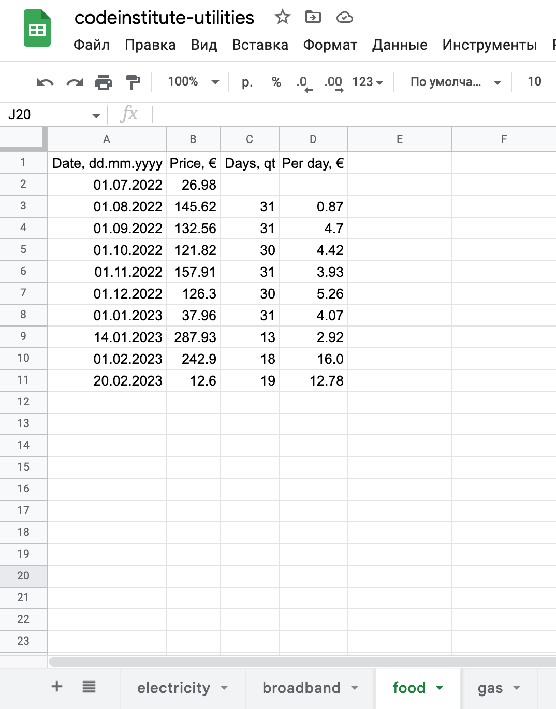
</details><br/>

<details><summary><b>Name of gas worksheet: <i>gas</i></b></summary>

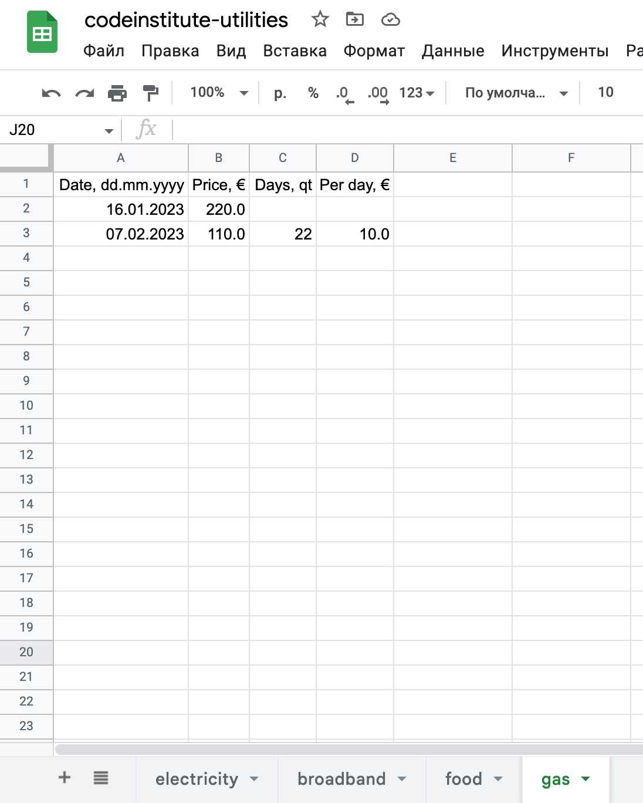
</details><br/>

This structure is intended to make it easy to add other utilities in the future. Utility bills are slightly different. Electricity is calculated based on the meter readings and the price per unit of consumed energy. Gas and food bills are paid before actual consumption, so the calculation of the consumption of these indicators is carried out only after entering new data. The bill for the broadband is issued after a certain period of use of this service.

The worksheets for utilities without meter reading (*broadband*, *food* and *gas*) hold 4 columns with information such as *Date* in format *dd.mm.yyyy*, *Price* with currency *€*, *Days* quantity - *qt* and *Per day* expenses in *€*, that is being controlled from the application via Python.

The worksheet for utilitie with meter reading (*electricity*) holds 7 columns with information such as *Date* in format *dd.mm.yyyy*, *Meter* in *kWh*, *Price* with currency *€*, *Cons.* which is consumption since the last measuring in *kWh*, *Days* quantity - *qt*, *Per day* consumption in *kWh* and *Per day* expenses in *€*, that is being controlled from the application via Python.

[Back to top](<#contents>)

## Design Choices

* ### Typography
    No specific typography is being used in the application. The font is just the standard font that is being used in the terminal.

* ### Colour Scheme
    'Utility Control 3' is a terminal based application. I have used the [Rich](https://rich.readthedocs.io/en/stable/introduction.html) library for Python to be able to extend the design opportunities.

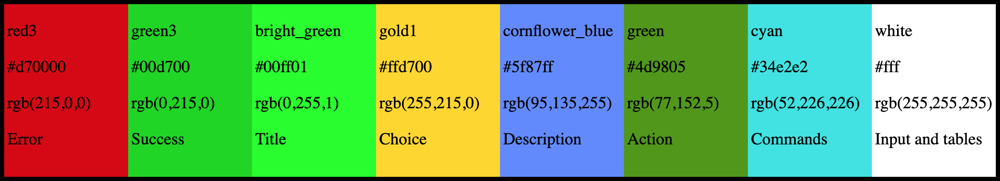

[Back to top](<#contents>)

# Features

When the application starts it prints the welcome message and brief description, then calls the *main* function which launches the main menu. As stated in the [Site Structure](<#site-structure>) area the application consists of 4 similar areas (different utilities): *electricity*, *broadband*, *food*, and *gas*. The features are being explained more in detail in the [Existing Features](<#existing-features>) area below.

## Existing Features

### Main Menu
The Main Menu is quite straight forward and consists of 4 choices. See each choice being explained below.

<details><summary><b>Main Menu</b></summary>

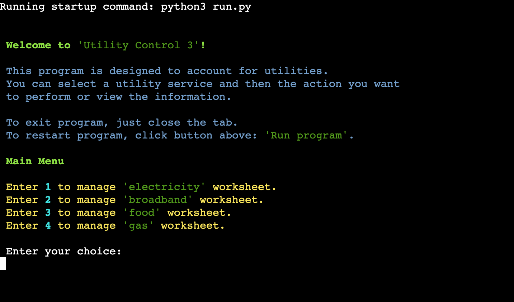
</details><br/>

[Back to top](<#contents>)

### Action Menu
The Action Menu is a submenu of Main Menu and its the same to all utilities except of the name of utility in the title. It consists of 4 different areas (functions) and an exit option: *add one row*, *delete last row*, *check statistics*, *see the table*, *go back*.

<details><summary><b>Action Menu</b></summary>

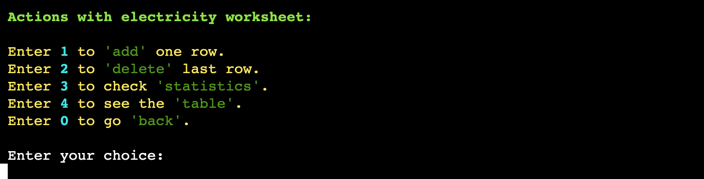
</details><br/>

[Back to top](<#contents>)

### Add one row
The add row to worksheet let's the user add new bill to the table. The user gets a description of the data that he is required to enter and immediately requires the first data to be entered. The required input data differs depending on the type of utility service. Date must be entered first. To help the user in the date input, the description displays the date of the previous input as well as the current date. Then the user needs to enter the meter reading, description also shows previous readings. If the utility does not provide meter readings, then this step is not displayed and is skipped. At last user needs to enter the price of utilitie, to help the user in the input, the price of the previous input is displayed.

<details><summary><b>Add one row</b></summary>

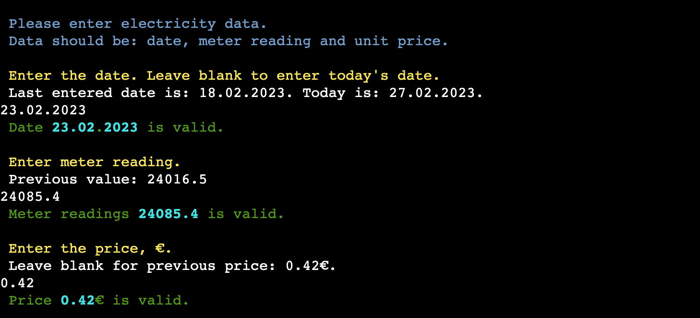
</details><br/>

[Back to top](<#contents>)

### Automatic input
For more convenient use of the program, it is possible to enter the current date and the previous price without any input data by pressing the Enter button.

<details><summary><b>Automatic input</b></summary>

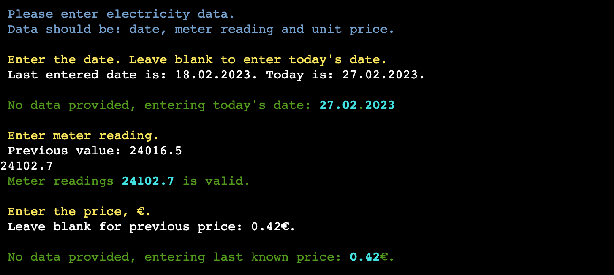
</details><br/>

[Back to top](<#contents>)

### Data validation
The previous data is shown to the user as an example of the input format. But if the input is incorrect, then the user will be shown a corresponding error and the need for input will be repeated until the user enters data in the required format.

<details><summary><b>Date validation</b></summary>

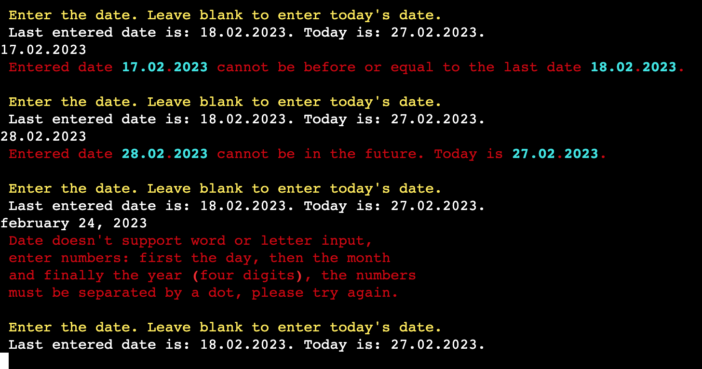
</details><br/>

<details><summary><b>Meter reading validation</b></summary>

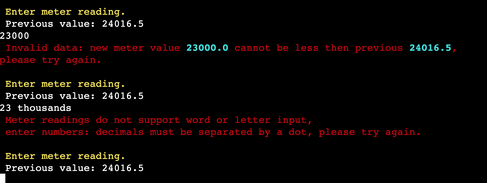
</details><br/>

<details><summary><b>Price validation</b></summary>

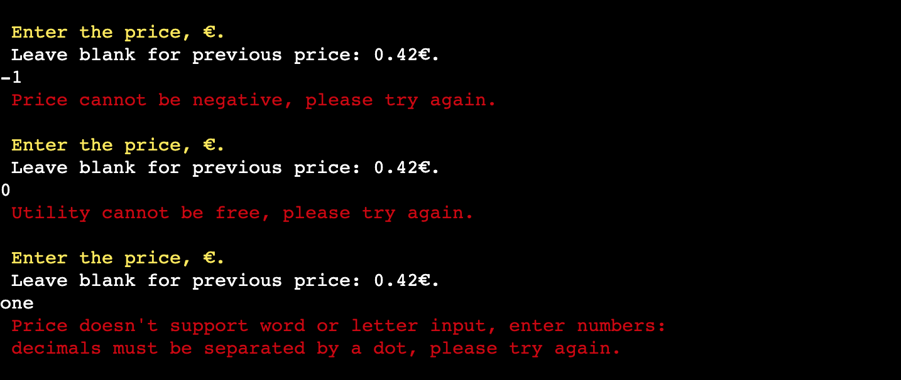
</details><br/>

[Back to top](<#contents>)

### Delete last row
The delete last row function is very straightforward. It displays a confirmation menu for deletion. If the user chooses '1', the last row is removed, and the user heads to the Action Menu. The user can also choose '0' to cancel the deletion and head back to the Action Menu.

<details><summary><b>Delete last row</b></summary>

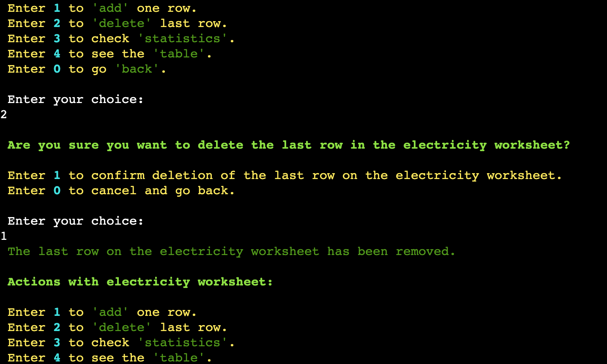
</details><br/>

[Back to top](<#contents>)

### Check statistics
This function is a sub-menu where you can select one of three options for statistics for different periods of time and press '0' to return to the Action Menu or '9' to return to the Main Menu.

<details><summary><b>Statistics Menu</b></summary>

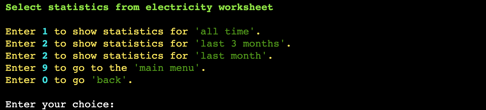
</details><br/>

<details><summary><b>Statustics for all time</b></summary>

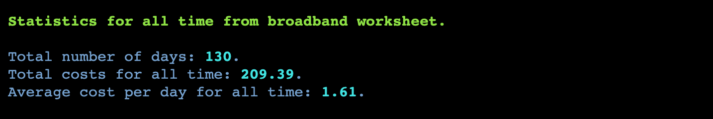
</details><br/>

<details><summary><b>Statustics for last 3 month</b></summary>

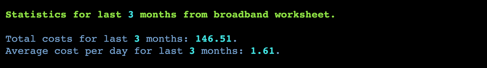
</details><br/>

<details><summary><b>Statustics for last month</b></summary>

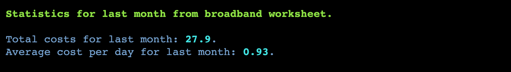
</details><br/>

[Back to top](<#contents>)

### See the table
This function simply lists the table of utility by retrieving all data from the relevant Google Sheet. The table functionality is a part of the [Rich](https://rich.readthedocs.io/en/stable/introduction.html) Python library.

<details><summary><b>See the table</b></summary>

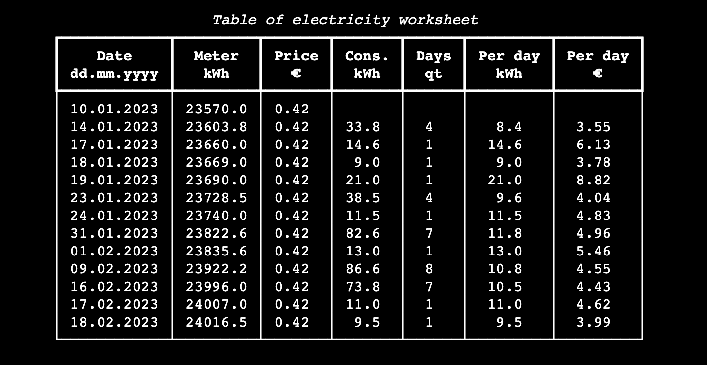
</details><br/>

[Back to top](<#contents>)

## Future Features

* Add other type of storing (i.e. MySql or a JSON-file) to speed up the application.
* Add other types of utility.
* Change in calculations, taking into account the peculiarities of payment for utilities in Ireland.
* Adding the ability to control multiple households.

[Back to top](<#contents>)

# Technologies Used

## Languages

* [Python](https://en.wikipedia.org/wiki/Python_(programming_language)) - provides the functionality for the application.

## Python Packages
* [GSpread](https://pypi.org/project/gspread/) - a Python API for Google Sheets that makes it possible to transfer data between the application and the Google Sheet.
* [Datetime](https://docs.python.org/3/library/datetime.html) - a module supplies classes for manipulating dates and times.
* [Rich](https://rich.readthedocs.io/en/stable/introduction.html) - Rich is a Python library that makes command line applications visually more appealing.

[Back to top](<#contents>)

## Frameworks, Libraries & Software

* [Visual Studio Code](https://code.visualstudio.com/) - IDE used to develop the website.
* [Github](https://github.com/) - used for versin control, to deploy and host the website.
* [Google Sheets](https://www.google.co.uk/sheets/about/) - used to host the application data.
* [Heroku](https://en.wikipedia.org/wiki/Heroku) - a cloud platform that the application is deployed to.
* [I Love IMG](https://www.iloveimg.com/) - online photo editor to crop and resize photos for ReadMe.

[Back to top](<#contents>)

# Testing

## Functionality Testing

The functional final test was carried out. All works as expected.

[Back to top](<#contents>)

### User Stories Testing

ID | Player stories | Requirement met |
| - | --------- | --------------- |
| 1 | As a user, I want to be able to add expense entries. | Yes | 
| 2 | As a user, I want to be able to delete an expense entry in case of erroneous entries. | Yes | 
| 3 | As a user, I want to have access to the function to calculate the statistics of the average consumption of funds for a communal service per day. | Yes |
| 4 | As a user, I want to be able to view a table with all expense records. | Yes |
| 5 | As a user, I want to have an easy way to return to the main menu. | Yes |

[Back to top](<#contents>)

### Full Manual Testing

The program starts automatically when you open the tab as expected.

1. Main Menu. Input/Output as expected. No bugs found.

| **Feature**   | **Action**                    | **Expected Result**          | **Actual Result** |
| ------------- | ----------------------------- | ---------------------------- | ----------------- |
| Main Menu | Enter '1' | Navigation to Action Menu of 'electricity' worksheet | Works as expected |
| Main Menu | Enter '2' | Navigation to Action Menu of 'broadband' worksheet | Works as expected |
| Main Menu | Enter '3' | Navigation to Action Menu of 'food' worksheet | Works as expected |
| Main Menu | Enter '4' | Navigation to Action Menu of 'gas' worksheet | Works as expected |
| Main Menu | Enter something else | Return the correct error message | Works as expected |

2. Action Menu. Input/Output as expected. No bugs found.

| **Feature**   | **Action**                    | **Expected Result**          | **Actual Result** |
| ------------- | ----------------------------- | ---------------------------- | ----------------- |
| Action Menu | Enter '1' | Data input request | Works as expected |
| Action Menu | Enter '2' | Navigation to deletion confirmation menu | Works as expected |
| Action Menu | Enter '3' | Navigation to Statistics Menu | Works as expected |
| Action Menu | Enter '4' | Output of a relevant table | Works as expected |
| Action Menu | Enter '0' | Navigation to Main Menu | Works as expected |
| Action Menu | Enter something else | Return the correct error message | Works as expected |

3. Statistics Menu. Input/Output as expected. No bugs found.

| **Feature**   | **Action**                    | **Expected Result**          | **Actual Result** |
| ------------- | ----------------------------- | ---------------------------- | ----------------- |
| Statistics Menu | Enter '1' | Relevant data output | Works as expected |
| Statistics Menu | Enter '2' | Relevant data output | Works as expected |
| Statistics Menu | Enter '3' | Relevant data output | Works as expected |
| Statistics Menu | Enter '9' | Navigation to Main Menu | Works as expected |
| Statistics Menu | Enter '0' | Navigation to Action Menu | Works as expected |
| Statistics Menu | Enter something else | Return the correct error message | Works as expected |

4. Deletion Confirmation Menu. Input/Output as expected. No bugs found.

| **Feature**   | **Action**                    | **Expected Result**          | **Actual Result** |
| ------------- | ----------------------------- | ---------------------------- | ----------------- |
| Deletion Confirmation Menu | Enter '1' | Relevant data deletion | Works as expected |
| Deletion Confirmation Menu | Enter '0' | Navigation to Action Menu | Works as expected |
| Deletion Confirmation Menu | Enter something else | Return the correct error message | Works as expected |

5. Data validation. Input/Output as expected. No bugs found.

| **Feature**   | **Action**                    | **Expected Result**          | **Actual Result** |
| ------------- | ----------------------------- | ---------------------------- | ----------------- |
| Date validation | Enter the correct date in the correct format | Output a message about successful input | Works as expected |
| Date validation | Enter the incorrect date in the correct format | Return the correct error message | Works as expected |
| Date validation | Enter something else | Return the correct error message | Works as expected |
| Meter reading validation | Enter the number greater than the previous one in the correct format | Output a message about successful input | Works as expected |
| Meter reading validation | Enter the number lower than the previous one in the correct format | Return the correct error message | Works as expected |
| Meter reading validation | Enter something else | Return the correct error message | Works as expected |
| Price validation | Enter the number in the correct format | Output a message about successful input | Works as expected |
| Price validation | Enter the number in the incorrect format | Return the correct error message | Works as expected |
| Price validation | Enter zero | Return the correct error message | Works as expected |
| Price validation | Enter negative number in the correct format | Return the correct error message | Works as expected |
| Price validation | Enter something else | Return the correct error message | Works as expected |

[Back to top](<#contents>)

## Code Validation

'Utility Control 3' is a terminal based application, so there is no need for HTML or CSS validation. Python code was validated according to PEP8 using the [CI Python Linter](https://pep8ci.herokuapp.com/). Found errors have been corrected.

<details><summary><b>PEP Validation Result</b></summary>

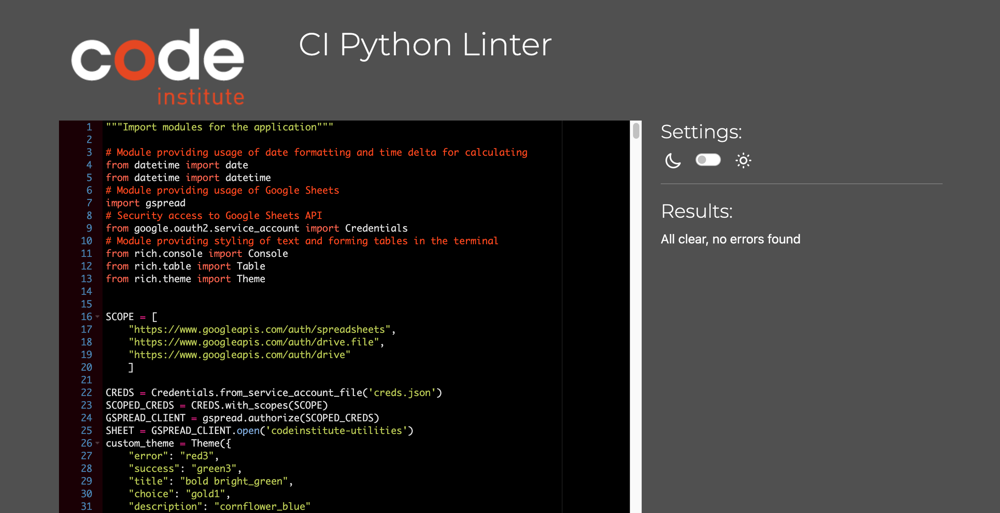
</details><br/>

[Back to top](<#contents>)

## Responsivenes

This project does not require responsive design.

[Back to top](<#contents>)

## Browser Compatibility

'Utility Control 3' was tested on the following browsers with no visible issues for the user: Google Chrome, Opera, Microsoft Edge, Apple Safari and Mozilla Firefox. No visible or funcional issues on all browsers.

[Back to top](<#contents>)

## Known Bugs

### Resolved

The column containing the dates truncated the year digit.

<details><summary><b>Initial state</b></summary>

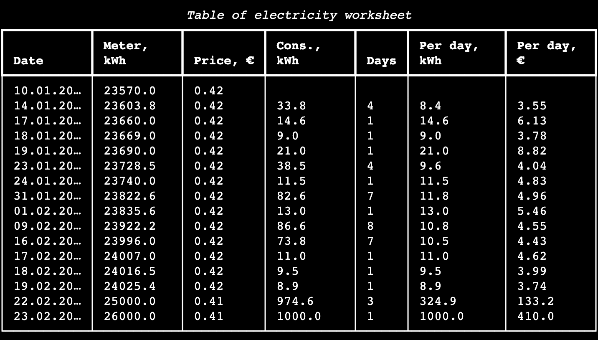
</details><br/>

#### Approach 1:

Adding ```no_wrap=False``` to the ```add_column``` function.

<details><summary><b>No wrap</b></summary>

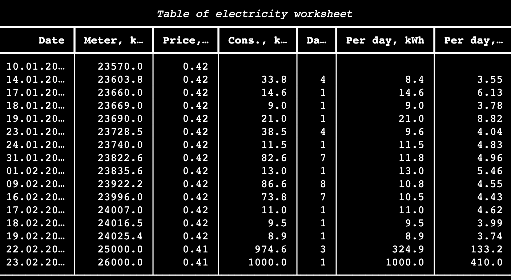
</details><br/>

#### Approach 2:

Adding ```overflow="fold"``` to the ```add_column``` function.

<details><summary><b>Overflow fold</b></summary>

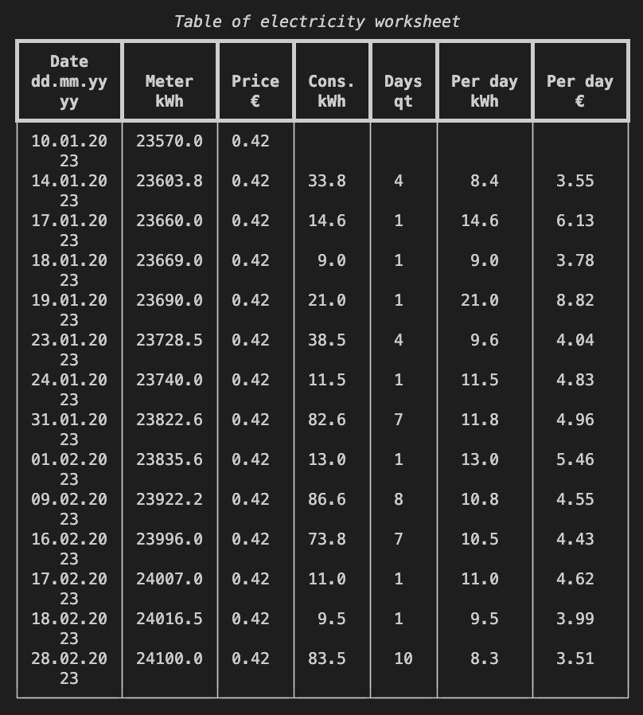
</details><br/>

#### Approach 3:

Building a table using [rich.box](https://rich.readthedocs.io/en/stable/appendix/box.html): ```table = Table(box=box.MINIMAL_DOUBLE_HEAD)```.

<details><summary><b>Rich.box</b></summary>

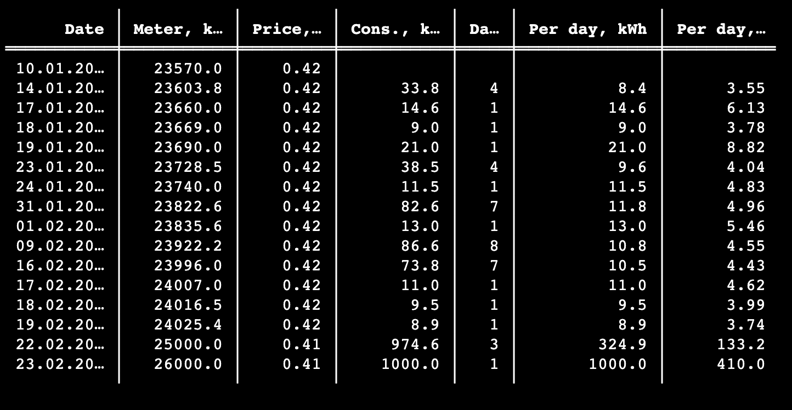
</details><br/>

#### Approach 4 (chosen):

Adding ```min_width=10``` to the ```add_column``` function.

<details><summary><b>Min width</b></summary>

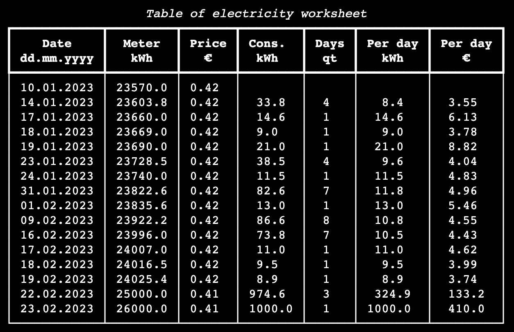
</details><br/>

[Back to top](<#contents>)

### Unresolved

Entering data too quickly can lead to unexpected results.

#### Approach 1:

Add other type of storing (i.e. MySql or a JSON-file) to speed up information output.

#### Approach 2:

Add progress indicator and show it to the user while loading data.

[Back to top](<#contents>)

## Additional Testing

### Lighthouse

'Utility Control 3' is a terminal based application, so there is no need for Lighthouse testing.

[Back to top](<#contents>)

### Peer review

In addition to the above testing the beta version of the site was put through its paces by peers, both in the software development field and outside. The results highlighted validation weakness, minor spelling and grammar errors that have since been fixed.

[Back to top](<#contents>)

# Deployment

## Deployment To Heroku

The project was deployed to [Heroku](https://www.heroku.com). To deploy, please follow the process below:

1. The first step is to log in to Heroku (or create an account if needed).

<details><summary><b>Heroku Step 1</b></summary>

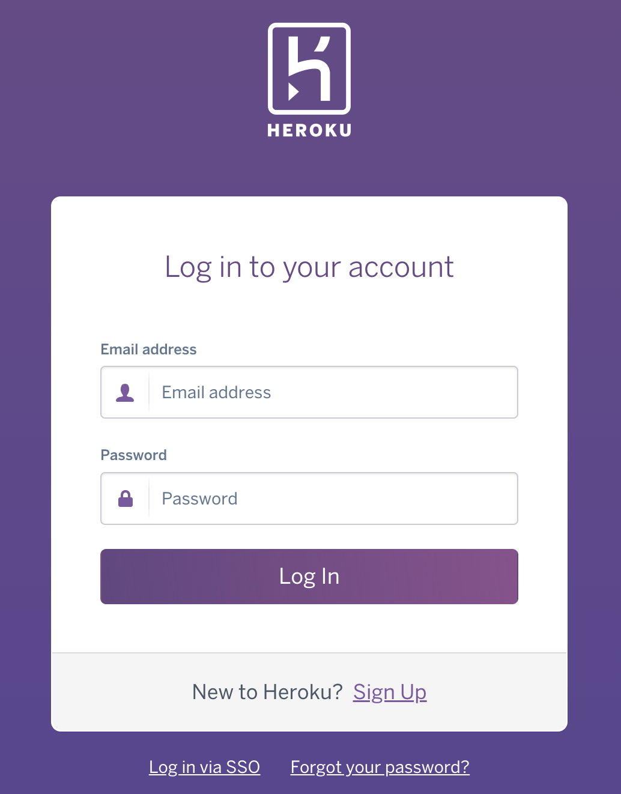
</details><br />

2. In the top right corner there is a button that is labeled 'New'. Click that and then select 'Create new app'.

<details><summary><b>Heroku Step 2</b></summary>

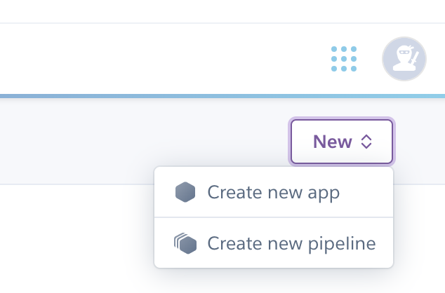
</details><br />

3. Now it's time to enter an application name that needs to be unique. When you have chose the name, choose your region and click 'Create app".

<details><summary><b>Heroku Step 3</b></summary>

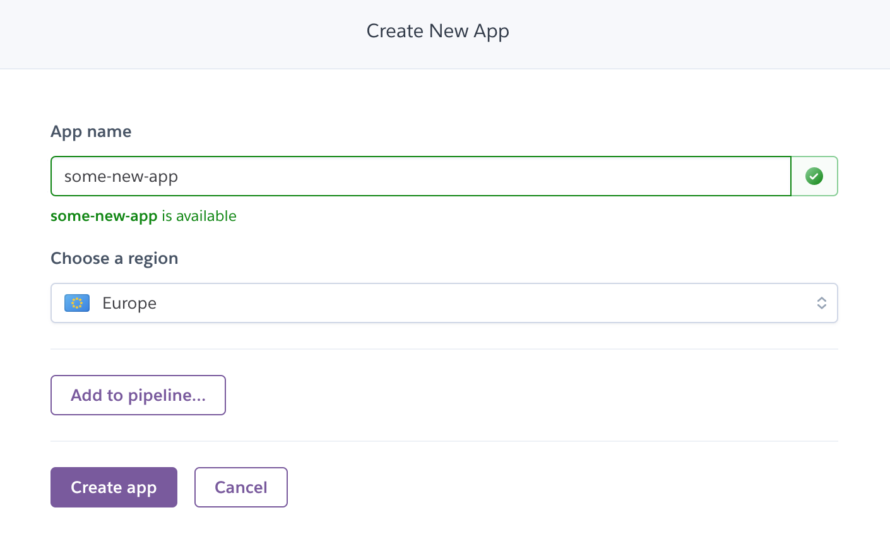
</details><br />

4. On the next page, click the 'Settings' tab and find the "Config Vars" section. When you have found it, click "Reveal Config Vars". Now it's time to add values. In the 'Utility Control 3' case I needed to add two values. The first one was the credentials (KEY input field = "CREDS", VALUE input field = "your credentials", I have hid my credentials for security reasons), click the 'Add' button. Next you need to add another key, enter "PORT" in the KEY input field and "8000" in the VALUE field, click the 'Add' button.

<details><summary><b>Heroku Step 4</b></summary>

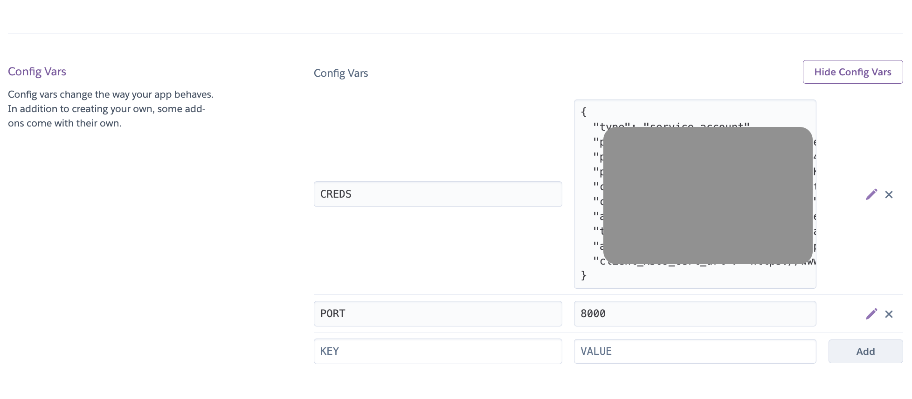
</details><br />

5. Next step is to add buildpacks to the application which will run when the application is deployed. The reason why this is needed is because all dependencies and configurations will be installed for the application. To do this you scroll down to the buildpacks section on the settings page and click the button 'Add buildpack'.

<details><summary><b>Heroku Step 5</b></summary>

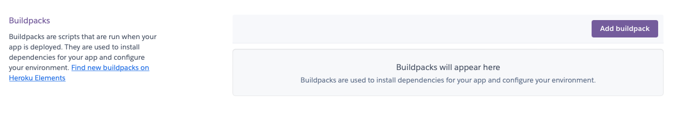
</details><br />

6. Add "Python" and node.js". It is important that Python is listed above node.js. If it's not you can sort it by dragging and dropping.

<details><summary><b>Heroku Step 6</b></summary>

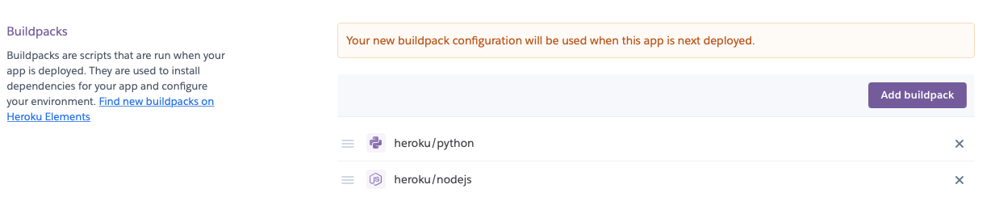
</details><br />

7. Now it's time for deployment. Scroll to the top of the settings page and click the 'Deploy' tab. For deployment method, select 'Github'. Search for the repository name you want to deploy and then click connect.

<details><summary><b>Heroku Step 7</b></summary>

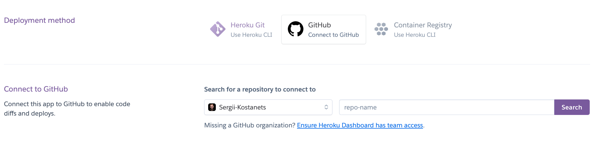
</details><br />

8. Scroll down on the deploy page and choose deployment type. Choose to enable automatic deployments if you want to and then  click 'Deploy Branch'.

<details><summary><b>Heroku Step 8</b></summary>

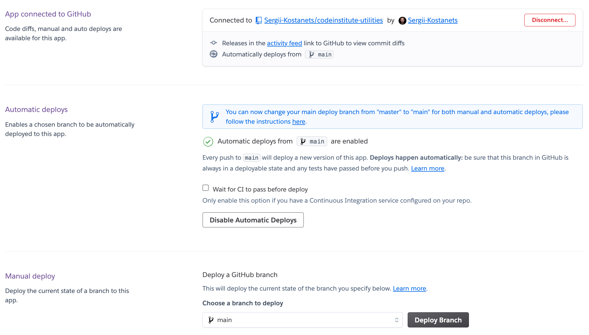
</details><br />

The live link to the 'Utility Control 3' Github repository can be found [here](https://github.com/Sergii-Kostanets/codeinstitute-utilities).

## To fork the repository on GitHub

A copy of the GitHub Repository can be made by forking the GitHub account. This copy can be viewed and changes can be made to the copy without affecting the original repository. Take the following steps to fork the repository;

1. Log in to **GitHub** and locate the [repository](https://github.com/Sergii-Kostanets/codeinstitute-utilities).
2. On the right hand side of the page inline with the repository name is a button called **'Fork'**, click on the button to create a copy of the original repository in your GitHub Account.

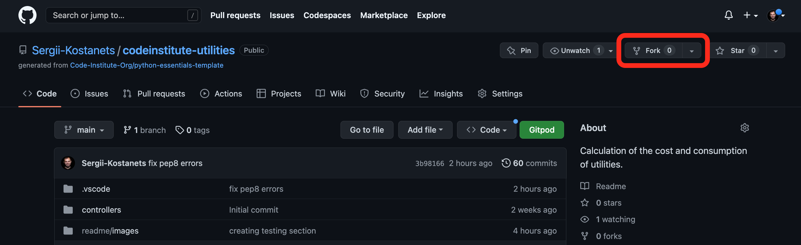

### To create a local clone of this project

The method from cloning a project from GitHub is below:

1. Under the repository’s name, click on the **code** tab.
2. In the **Clone with HTTPS** section, click on the clipboard icon to copy the given URL.
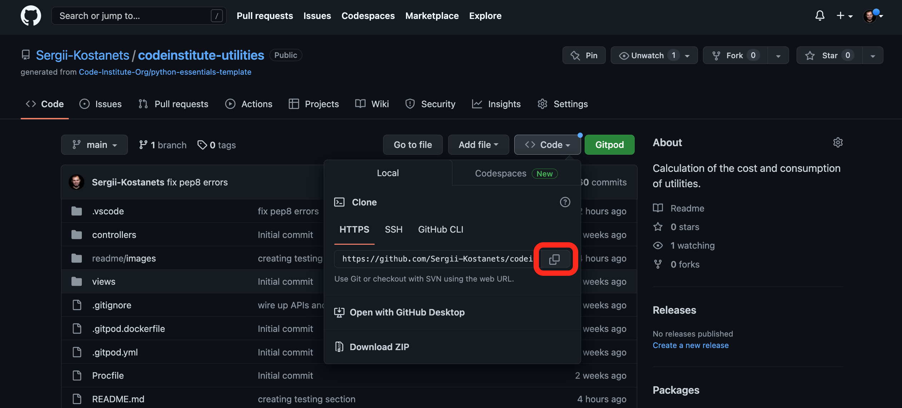
3. In your IDE of choice, open **Git Bash**.
4. Change the current working directory to the location where you want the cloned directory to be made.
5. Type **git clone**, and then paste the URL copied from GitHub.
6. Press **enter** and the local clone will be created.

[Back to top](<#contents>)

# Credits

## Content

* All text content written by Sergii Kostanets.
* Base structure and functionality came from a [Love Sandwiches Walkthrough Project](https://learn.codeinstitute.net/courses/course-v1:CodeInstitute+LS101+2021_T1/courseware/293ee9d8ff3542d3b877137ed81b9a5b/58d3e90f9a2043908c62f31e51c15deb/).
* As an example of a readme file was taken file of author [Marcus Eriksson](https://github.com/worldofmarcus/project-portfolio-3#readme)

## Media

* The photos were compressed using [I Love IMG](https://www.iloveimg.com/).

[Back to top](<#contents>)

# Acknowledgements

The application 'Utility Control 3' was completed as the Portfolio Project #3 (*Python*) for the Full Stack Software Development Diploma at the [Code Institute](https://codeinstitute.net/). I would like to thank my mentor [Precious Ijege](https://www.linkedin.com/in/precious-ijege-908a00168/), the Slack community, and all at the Code Institute for their help and support.

[Sergii Kostanets](https://sergiikostanets.netlify.app/), February 2023.
