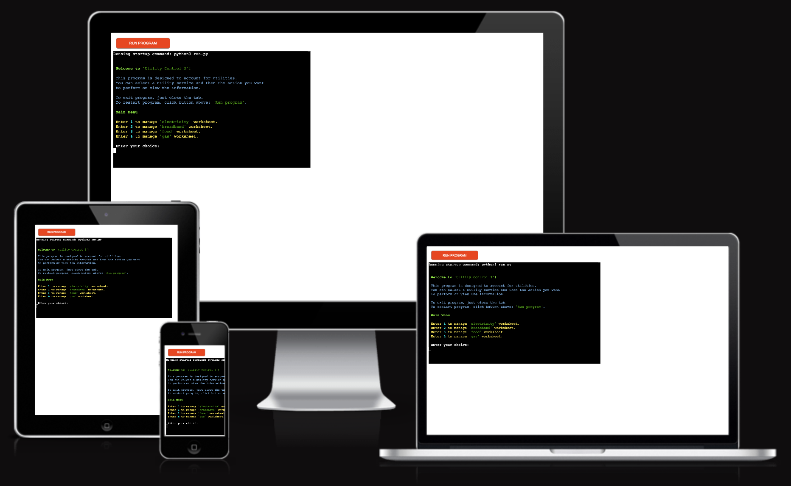

# **Utility Control 3**

'Utility Control 3' is an application that helps user to control your utility bills. This is the third project in the Full Stack Software Development course. And this is my third way to control my expenses. The first method of writing in a notepad is inconvenient. The second way - using mobile applications, is good, but I always dreamed of making a free system. And this third way - the program I wrote, is the first step towards fulfilling the dream of creating my application for controlling expenses.

# Contents

* [**Project**](<#project>)
  * [Site Users Goal](<#site-users-goal>)
  * [User Stories](<#user-stories>)
  * [Site Owners Goal](<#site-owners-goal>)
* [**User Experience UX**](<#user-experience-ux>)
  * [Site Structure](<#site-structure>)
  * [Design Choices](<#design-choices>)
* [**Features**](<#features>)
  * [**Existing Features**](<#existing-features>)
    * [Header](<#header>)
    * [Buttons](<#buttons>)
    * [Main section](<#main-section>)
    * [Information section](<#information-section>)
    * [Footer](<#footer>)
  * [**Future Features**](<#future-features>)
* [**Technologies Used**](<#technologies-used>)
* [**Testing**](<#testing>)
* [**Deployment**](<#deployment>)
* [**Credits**](<#credits>)
  * [**Content**](<#content>)
  * [**Media**](<#media>)
* [**Acknowledgements**](<#acknowledgements>)

## Project

### Site Users Goal
The user of 'Utility Control 3' wants to have access to an intuitive application that saves utility bills and calculates daily usage.

### User Stories
I have included some user stories to clarify why particular feature matters. These will then be tested and confirmed in the [Testing](<#testing>) section.

- As a user, I want to be able to add expense entries.
- As a user, I want to be able to delete an expense entry in case of erroneous entries.
- As a user, I want to have access to the function to calculate the statistics of the average consumption of funds for a communal service per day.
- As a user, I want to be able to view a table with all expense records.
- As a user, I want to have an easy way to return to the main menu.

### Site Owners Goal
The goal of the site owner is to provide an application where the user can enter utility expense data in a simple way, access all expense records, view expense statistics, and delete the entry in case of incorrect input.

[Back to top](<#contents>)

## User Experience (UX)

The 'Utility Control 3' application has a command line interface with a custom theme. The color scheme is selected in such a way as to be intuitive to the user and highlight: errors, successful input, selection menu, differences in selection options, the input that must be made for this selection, menu headings.

[Back to top](<#contents>)

### Site Structure

[Rock-Paper-Scissors-Lizard-Spock Game](https://sergii-kostanets.github.io/codeinstitute-rock-paper-scissors-lizard-spock/) website has only one page:

* [Main](index.html)

The [main](index.html) page is the default loading page of the game.

[Back to top](<#contents>)

### Design Choices

* #### Typography

    The font chosen was 'Rubik' for for inscriptions in the game.
  * 'Rubik' font corresponds to the spirit of the game, perfectly conveys the mood and goes well with the selected icons.
  * Highlighting with different colors allows you to create an intuitive interface that contrasts well with itself and the background.

* #### Colour Scheme

  * The color palette is bright and colorful, emphasizing the entertaining style of the game based on pure randomness without any elements of strategy or tactics.
  * The colors of the main icons of the game are taken as a basis.

[Back to top](<#contents>)

## Features

[Rock-Paper-Scissors-Lizard-Spock Game](https://sergii-kostanets.github.io/codeinstitute-rock-paper-scissors-lizard-spock/) contains many features that the user would be familiar with, such as a header with link for refreshing the page, footer with contact links.

### Existing Features

* #### Header

  * The logo text is clickable with a link back to the home page for enhanced UX.

[Back to top](<#contents>)

* #### Buttons

  * The player choices are under the heading of calling for choices, designed to be close to each other and not provoke accidental taps on the big screen.

[Back to top](<#contents>)

* #### Main section

    The main section consists of three blocks.
  * On the left is a rule scheme that immediately changes to the symbol chosen by the player. Intuitively, it becomes clear that this is the choice of the player in the current round.
  * In the middle is a block consisting of three parts.
    * The number of points scored by the player. When the number of points reaches 10, the game ends with the player winning.
    * The timer starts counting down the first time a player is selected. When the timer reaches zero, the game ends.
    * The number of points scored by the computer. When the number of points reaches 10, the game ends with the player losing.
  * On the right is a scheme with rules that changes by itself some time after the choice of a player in each round. It is intuitively clear that this is the choice of the computer.

[Back to top](<#contents>)

* #### Information section

  * At the beginning, three lines display the rules of the game.
  * After the game starts, the first line displays the result of the round.
  * After the start of the game, the second line explains the reason for winning or losing in accordance with the rules of the game.

[Back to top](<#contents>)

* #### Footer

  * Contains contacts of the author of the site.
  * Contains social media links. To enhance the UX the links open in other tabs.
  * The social media presence will help the user with their research of referencies and will also encourage them to connect with owner.
  * The LinkedIn, Phone, GitHub and Instagram social links are there for the potential employers, to direct to the site owner's pages.

[Back to top](<#contents>)

### Future Features

* A registration to greet the user by name.
* A table of achievements.
* A choice of difficulty levels.
* Animation of symbol selection and win or loss process.

[Back to top](<#contents>)

## Technologies Used

* [HTML5](https://html.spec.whatwg.org/) - provides the content and structure for the website.
* [CSS3](https://www.w3.org/Style/CSS/Overview.en.html) - provides the styling.
* [JavaScript](https://www.w3schools.com/js/) - provides functionality.
* [Visual Studio Code](https://code.visualstudio.com/) - IDE used to develop the website.
* [Github](https://github.com/) - used for versin control, to deploy and host the website.
* [I Love IMG](https://www.iloveimg.com/) - online photo editor to crop and resize photos.

[Back to top](<#contents>)

## Testing

Please refer to [**_here_**](TESTING.md) for more information on testing Photo Shoot Fans.

[Back to top](<#contents>)

## Deployment

### **To deploy the project**

The site was deployed to GitHub pages. The steps to deploy a site are as follows:

  1. In the GitHub repository, navigate to the **Settings** tab.
  2. Once in Settings, navigate to the **Pages** tab on the left hand side.
  3. Under **Source**, select the branch to **main**, then click **save**.
  4. Once the main branch has been selected, the page will be automatically refreshed with a detailed ribbon display to indicate the successful deployment.

  The live link to the Github repository can be found [here](https://sergii-kostanets.github.io/codeinstitute-rock-paper-scissors-lizard-spock/).

### **To fork the repository on GitHub**

A copy of the GitHub Repository can be made by forking the GitHub account. This copy can be viewed and changes can be made to the copy without affecting the original repository. Take the following steps to fork the repository;

1. Log in to **GitHub** and locate the [repository](https://github.com/Sergii-Kostanets/codeinstitute-rock-paper-scissors-lizard-spock).
2. On the right hand side of the page inline with the repository name is a button called **'Fork'**, click on the button to create a copy of the original repository in your GitHub Account.

### **To create a local clone of this project**

The method from cloning a project from GitHub is below:

1. Under the repository’s name, click on the **code** tab.
2. In the **Clone with HTTPS** section, click on the clipboard icon to copy the given URL.

3. In your IDE of choice, open **Git Bash**.
4. Change the current working directory to the location where you want the cloned directory to be made.
5. Type **git clone**, and then paste the URL copied from GitHub.
6. Press **enter** and the local clone will be created.

[Back to top](<#contents>)

## Credits

### Content

* The icons came from [Icon Library](https://icon-library.com/).
* Rules image came from [PNG item](https://www.pngitem.com/middle/hJJoibm_rock-paper-scissors-lizard-spock-is-a-funny/).
* Base structure, functionality and performance check came from a [Love Maths Walkthrough Project](https://learn.codeinstitute.net/courses/course-v1:CodeInstitute+LM101+2021_T1/courseware/2d651bf3f23e48aeb9b9218871912b2e/234519d86b76411aa181e76a55dabe70/).
* As an example of a readme file was taken file of author [Ewan Colquhoun](https://github.com/EwanColquhoun/wawaswoods#readme)

### Media

* The photos were compressed using [I Love IMG](https://www.iloveimg.com/).

[Back to top](<#contents>)

## Acknowledgements

The site was completed as a Portfolio 2 Project piece for the Full Stack Software Developer (e-Commerce) Diploma at the [Code Institute](https://codeinstitute.net/). As such I would like to thank my mentor [Precious Ijege](https://www.linkedin.com/in/precious-ijege-908a00168/), the Slack community, and all at the Code Institute for their help and support.

[Sergii Kostanets](https://sergiikostanets.netlify.app/), January 2023.

[Back to top](<#contents>)
